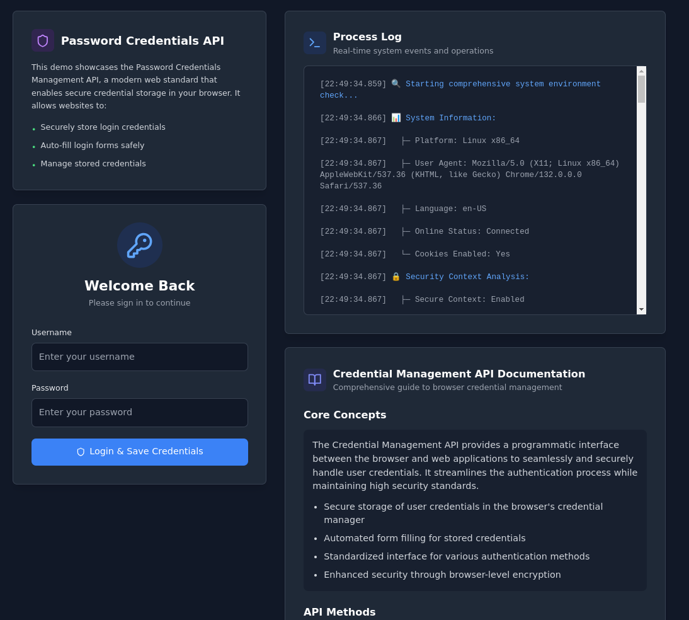

# Credential Management API Demo

[](LICENSE)  [](https://reactjs.org/)  [](https://www.typescriptlang.org/)  [](https://vitejs.dev/)  [](https://tailwindcss.com/)  [](CONTRIBUTING.md)

A modern, production-ready demonstration of the Browser's Credential Management API with React and TypeScript. This application showcases secure credential storage and management in web browsers with a beautiful, responsive UI.

## Features

- Secure credential storage using the Browser's Credential Management API
- Dark/Light theme support
- Fully responsive design
- Real-time process logging
- Security context validation
- Modern UI with Tailwind CSS
- System environment analysis



## Tech Stack

- React 18
- TypeScript
- Tailwind CSS
- Vite
- Lucide Icons

## Getting Started

1. Clone the repository
2. Install dependencies:
   ```bash
   npm install
   ```
3. Start the development server:
   ```bash
   npm run dev
   ```

## Security Features

- Origin binding for credentials
- Secure context validation
- User mediation for credential storage
- Browser-level encryption
- Automatic security environment analysis

## API Methods

The application demonstrates the following Credential Management API methods:

- `navigator.credentials.store()`: Securely stores user credentials
- `navigator.credentials.get()`: Retrieves stored credentials
- `navigator.credentials.preventSilentAccess()`: Prevents automatic sign-in

## Browser Support

The Credential Management API requires:

- A secure context (HTTPS or localhost)
- A modern browser that supports the API
- User consent for credential storage

## Development

```bash
# Install dependencies
npm install

# Start development server
npm run dev

# Build for production
npm run build

# Preview production build
npm run preview

# Lint code
npm run lint
```

## Creator

Ed Bates (TECHBLIP LLC)

## Acknowledgments

Some sections of this code were generated with the assistance of AI tools.   These contributions were reviewed and integrated by the project creator(s).

## License

Apache-2.0 license - see the [LICENSE](LICENSE) file for details
